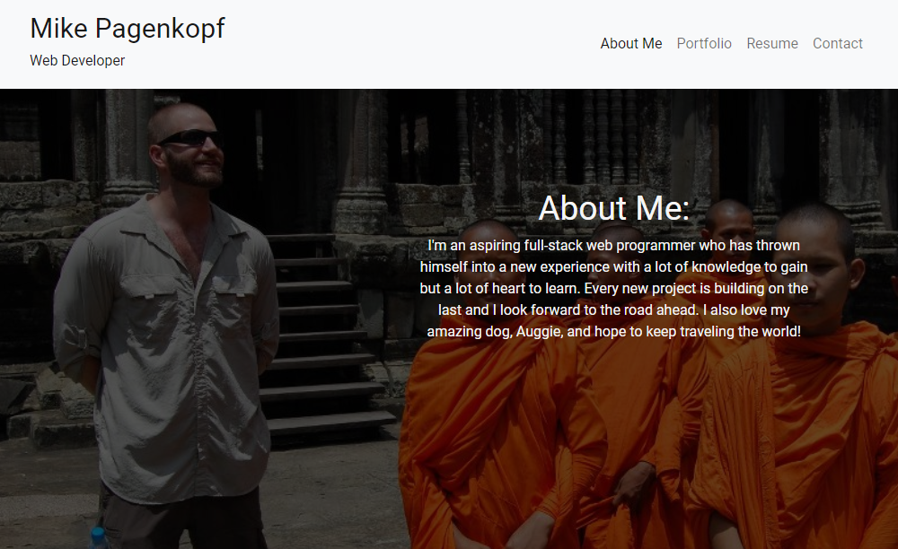
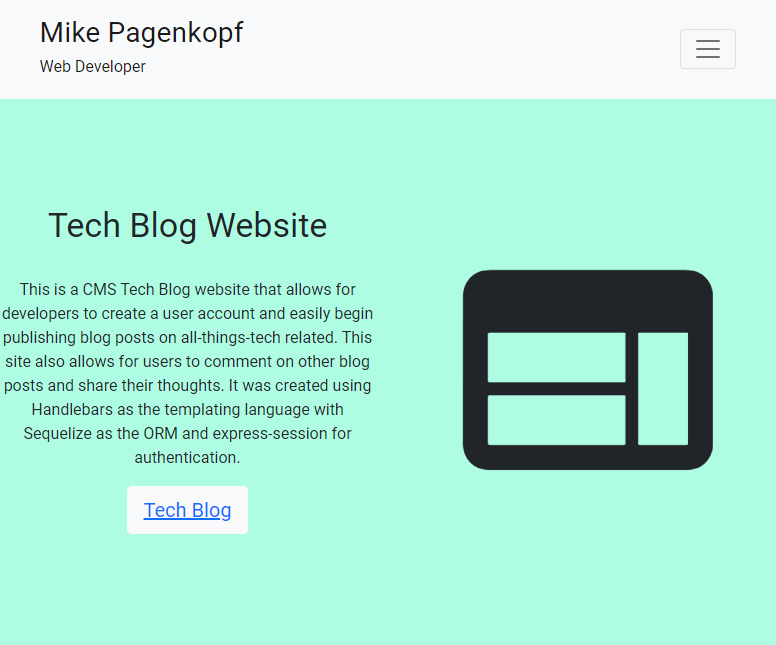

# Portfolio Site

* [Mike Pagenkopf's Full Stack Programming Portfolio](https://mjpagenkopf-programming-portfolio.netlify.app/)

## Description

This is a my programmer portfolio site, built with React. Contains a landing page, which doubles as the About Me. Also includes a portfolio page with several links to various programming projects I've created for bootcamp. There is also a link to a resume which will need updating as well as a contact page that will need to connect to the backend.

## Table of Contents

* [Installation](#Install)
* [Contribution](#Contribution-Guidelines)
* [Test](#Test-Instructions)
* [License](#License)

## Installation

The site itself is built using Node npm in React using Bootstrap. If running from local computer, will need to run npm install from the terminal and npm start to deploy to localhost. It is deployed using my Netlify account.

## Contribution Guidelines

Tutor sessions, Reviewing assignments, help from Instructor and TAs, and bootstrap documentation.

## Test Instructions

not applicable at this time

## License

not applicable

## Contact

* Github Username: mpagenkopf

* Email: pagenkopf.edit@gmail.com

* Link to Repository: [Repository](https://github.com/mjpagenkopf/react_portfolio)

* Link to Netlify Live App: [Netlify App](https://pagenkopf-portfolio.netlify.app)